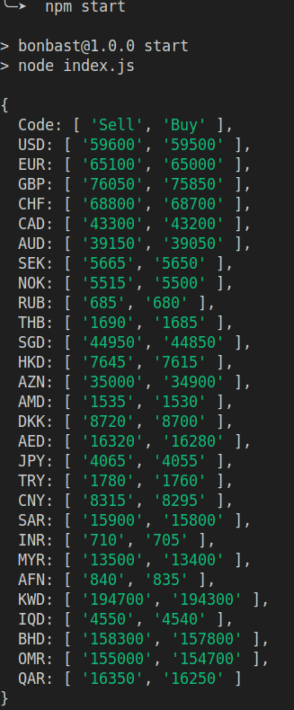

# Bonbast Scraper

This project is a web scraper for extracting currency exchange rates from the Bonbast website using Puppeteer and Cheerio. 




## Prerequisites

Ensure you have the following installed:

- [Node.js](https://nodejs.org/) (version 12 or later)
- [npm](https://www.npmjs.com/) (comes with Node.js)

## Usage

```bash
git clone https://github.com/maanimis/bonbastScraper.git
```
```bash
cd bonbastScraper
```
```bash
npm i
```
```bash
npm start
```


## Configuration

    (--proxy-server=http://127.0.0.1:20171). Modify or remove this argument in the initDriver() method as needed.

    Executable Path: The executablePath is set to /usr/bin/google-chrome-stable. Update this path if you're using a different version of Chrome or Chromium.
